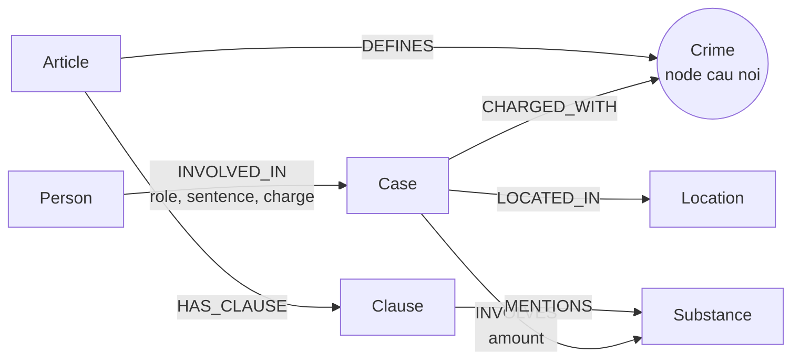

# Thiết kế Ontology — Day 19

**Họ tên:** Le Van Viet  **MSSV:** 2A202602504

**Lựa chọn**:
- [x] Dùng ontology gợi ý (có chỉnh phần context retrieval)
- [ ] Tự thiết kế (xét bonus +15, xem `SUBMISSION.md`)

## 1. Sơ đồ

## 2. Entity types (node labels)

| Label | Ý nghĩa | Khóa định danh (`MERGE` theo) | Properties | Lấy từ KB nào | Trích bằng |
| --- | --- | --- | --- | --- | --- |
| `Article` | Điều luật | `id` | `id`, `title`, `law`, `doc_id` | Luật | Regex từ metadata và tiêu đề |
| `Clause` | Khoản trong Điều luật | `id` | `id`, `number`, `penalty`, `text`, `doc_id` | Luật | Regex tách khoản và khung hình phạt |
| `Crime` | Tội danh chuẩn hóa | `name` | `name` | Luật và tin tức | Regex từ luật; LLM + `link_entity` từ tin |
| `Case` | Vụ việc/vụ án trong bài báo | `name` | `name`, `summary`, `date`, `doc_id`, `source_title` | Tin tức | LLM trích JSON |
| `Person` | Người liên quan trong vụ việc | `name` | `name`, `aliases` | Tin tức | LLM trích JSON |
| `Substance` | Chất ma túy | `name` | `name` | Luật và tin tức | Regex danh sách chất; LLM + danh sách chuẩn |
| `Location` | Địa điểm vụ việc | `name` | `name` | Tin tức | LLM trích JSON |

## 3. Relationships

| Type | Từ → Đến | Properties trên cạnh | Ý nghĩa |
| --- | --- | --- | --- |
| `DEFINES` | `Article` → `Crime` | Không | Điều luật định nghĩa tội danh nào |
| `HAS_CLAUSE` | `Article` → `Clause` | Không | Điều luật có các khoản nào |
| `MENTIONS` | `Clause` → `Substance` | Không | Khoản luật nhắc tới chất ma túy nào |
| `CHARGED_WITH` | `Case` → `Crime` | Không | Vụ việc bị xử lý/truy tố theo tội danh nào |
| `INVOLVES` | `Case` → `Substance` | `amount` | Vụ việc liên quan tới chất và khối lượng nào |
| `LOCATED_IN` | `Case` → `Location` | Không | Địa điểm của vụ việc |
| `INVOLVED_IN` | `Person` → `Case` | `role`, `sentence`, `charge` | Người tham gia vụ việc với vai trò, tội danh, mức án |

## 4. Node cầu nối giữa 2 KB

- **Node nào:** `Crime`.
- **Vì sao chọn node này:** Tin tức thường nêu người/vụ việc bị bắt, truy tố hoặc xét xử về một tội danh; luật lại định nghĩa tội danh đó trong một `Article`. Vì vậy `Crime` nối được `Case` bên tin với `Article` bên luật qua đường `Case -> Crime <- Article`.
- **Cách đảm bảo hai phía khớp tên:** Tội danh từ luật được chuẩn hóa bằng `normalize_crime` (lowercase, bỏ tiền tố `Tội`). Tội danh do LLM trích từ tin được giới hạn bằng danh sách chuẩn trong prompt, sau đó vẫn đi qua `link_entity` để khớp chính xác sau normalize hoặc fuzzy matching bằng `difflib` với ngưỡng 0.8.
- **Khi nào cầu gãy, và xử lý thế nào:** Cầu gãy khi bài báo không nêu tội danh rõ ràng, LLM trích sai tên tội, hoặc tên tội trong tin không đủ giống tên chuẩn. Cách xử lý hiện tại là không nối bừa nếu dưới ngưỡng; hướng cải tiến là thêm alias tội danh phổ biến và kiểm chứng thủ công các bài không có `CHARGED_WITH`.

## 5. Competency questions

| Câu | Đường đi (Cypher pattern) | Trả lời được? |
| --- | --- | --- |
| Q1 | `(:Article {doc_id:'pcmt-dieu-2'})-[:HAS_CLAUSE]->(:Clause)` hoặc truy hồi chunk trực tiếp từ luật | Có |
| Q2 | `(:Person)-[:INVOLVED_IN {sentence}]->(:Case {doc_id: news_doc})` | Có |
| Q3 | `(:Person {name:'Lê Minh Thành'})-[:INVOLVED_IN]->(:Case)-[:CHARGED_WITH]->(:Crime)<-[:DEFINES]-(:Article)-[:HAS_CLAUSE]->(:Clause {number:1})` | Có |
| Q4 | `(:Person {aliases/name chứa 'Hoàng Nato'})-[:INVOLVED_IN]->(:Case)-[:CHARGED_WITH]->(:Crime)<-[:DEFINES]-(:Article)-[:HAS_CLAUSE]->(:Clause)` | Có, nếu LLM trích đúng alias/tội danh |
| Q5 | `(:Person {name:'Cái Quang Huy'})-[:INVOLVED_IN]->(:Case)-[:INVOLVES {amount}]->(:Substance {name:'MDMA'})` và `(:Case)-[:CHARGED_WITH]->(:Crime)<-[:DEFINES]-(:Article)-[:HAS_CLAUSE]->(:Clause)-[:MENTIONS]->(:Substance {name:'MDMA'})` | Có một phần; ngưỡng khối lượng vẫn nằm trong text của `Clause` |
| Q6 | `(:Case)-[:INVOLVES]->(:Substance {name:'MDMA'})` rồi lấy `Case.summary`, `source_title`, người liên quan | Có, phụ thuộc chất được LLM trích đúng |

## 6. Quyết định thiết kế và đánh đổi

1. Chọn `Crime` làm node cầu nối thay vì nối trực tiếp `Case` với `Article`. Cách này bền hơn khi nhiều Điều/khoản cùng được hỏi qua tên tội, nhưng phụ thuộc chuẩn hóa tội danh.
2. Chọn `Clause` là node riêng thay vì property list trên `Article`. Điều này giúp truy hồi khoản cụ thể và khung hình phạt dễ hơn, đổi lại graph nhiều node hơn.
3. Chọn regex cho luật và LLM cho tin tức. Luật có cấu trúc đều nên regex rẻ và ổn định; tin tức là văn xuôi nên LLM linh hoạt hơn nhưng có rủi ro sai JSON hoặc thiếu entity.
4. Chọn `Substance` là node dùng chung. Node này giúp nối case với khoản luật có nhắc chất tương ứng, nhưng hiện chưa mô hình hóa synonym đầy đủ và chưa parse khối lượng thành số.

## 7. So với ontology gợi ý

Không xét bonus. Bài sử dụng ontology gợi ý để ưu tiên hoàn thành đúng hợp đồng chấm tự động.

## 8. Hạn chế còn lại

- `Case` khóa theo tên do LLM đặt nên có thể trùng hoặc tách sai nếu hai bài nói cùng một vụ bằng tên khác nhau.
- `Person` khóa theo họ tên, chưa có cơ chế hợp nhất alias hoặc người trùng tên.
- Khối lượng ma túy vẫn là chuỗi trên cạnh `INVOLVES`, chưa parse thành số/đơn vị nên việc chọn khoản theo ngưỡng khối lượng vẫn dựa vào text của `Clause`.
- `Substance` chỉ dùng danh sách chuẩn nhỏ, chưa bao phủ mọi tên thương mại, biến thể chính tả hoặc chất mới.
